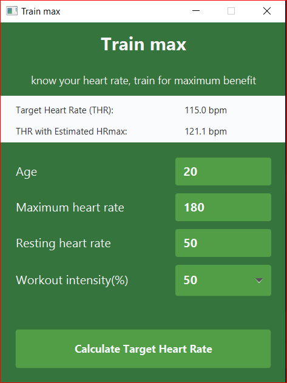

# TrainMax

###### Target Heart Rate (THR)
A desired range of heart rate reached during aerobic exercise which enables one's heart and 
lungs to receive the most benefit from a workout.

###### The maximum heart rate (HRmax)
The age-related highest number of beats per minute of the heart when reaching
a point of exhaustion without severe problems through exercise stress

###### Heart rate reserve (HRreserve)
The difference between a person's measured or predicted maximum heart
rate and resting heart rate.

> HRmax = 206.3 - (0.711 * age)\
> HRreserve = HRmax - HRrest

###### Target Heart Rate THR
For healthy people, the Target Heart Rate (THR) or Training Heart Rate Range (THRR) is a
desired range of heart rate reached during aerobic exercise which enables one's heart and
lungs to receive the most benefit from a workout.

The Karvonen method factors in resting heart rate (HRrest) to calculate target heart rate (THR),
using a range of 50–85% intensity: \
> THR = ((HRmax − HRrest) × % intensity) + HRrest

Equivalently,
> THR = (HRreserve × % intensity) + HRrest

Example for someone with a HRmax of 180 and a HRrest of 70 (and therefore a HRreserve of 110):
> 50% Intensity: ((180 − 70) × 0.50) + 70 = 125 bpm \
> 85% Intensity: ((180 − 70) × 0.85) + 70 = 163 bpm

For more about heart rates, visit [https://en.wikipedia.org/wiki/Heart_rate](https://en.wikipedia.org/wiki/Heart_rate), [https://en.wikipedia.org/wiki/Heart_rate#Karvonen_method](https://en.wikipedia.org/wiki/Heart_rate#Karvonen_method)